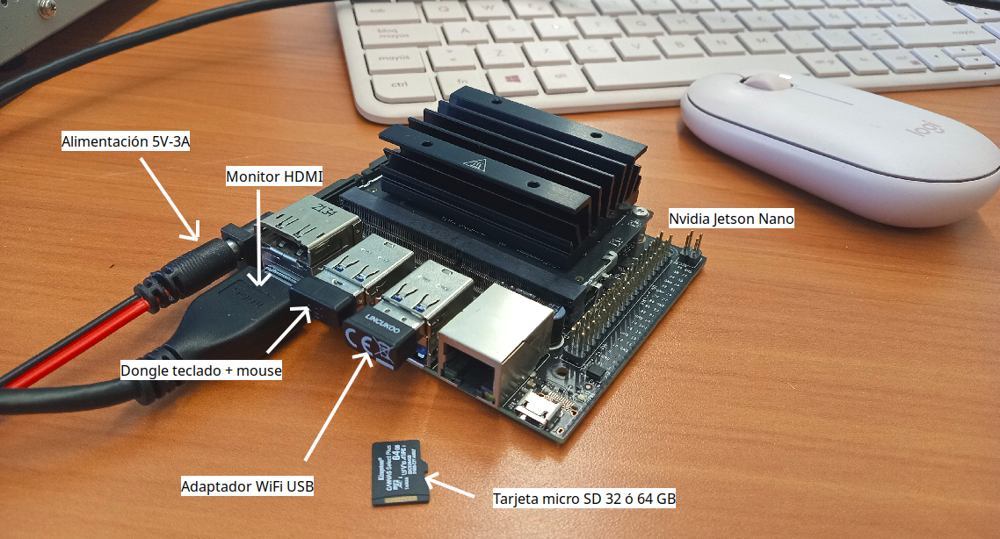

# jetson-nano-setup
Tutorial para la configuración de la tarjeta Nvidia Jetson Nano

## 1. Requerimientos
- Tarjeta Nvidia Jetson Nano version 2 GB ó 4 GB.
- Fuente de alimentación 5V-3A con conector barril o micro-USB, dependiendo del modelo.
- Tarjeta de memoria micro-SD, 32 GB (recomendable 64 GB si se trabajará con visión artificial o modelos LLM)
- Combo teclado + moude con adaptador dongle USB
- Monitor con interfaz HDMI
- Adaptador WiFi USB



## 2. Grabar la imagen del sistema operativo en la tarjeta micro-SD
Instrucciones detalladas en el sitio oficial: https://developer.nvidia.com/embedded/learn/get-started-jetson-nano-devkit#intro <br>
La imagen base a utilizar depende del modelo de tarjeta (2GB o 4GB):
- Jeton Nano Developer Kit versión 2GB: https://developer.nvidia.com/embedded/l4t/r32_release_v7.1/jp_4.6.1_b110_sd_card/jetson_nano_2gb/jetson-nano-2gb-jp461-sd-card-image.zip
- Jeton Nano Developer Kit versión 4GB: https://developer.nvidia.com/embedded/l4t/r32_release_v7.1/jp_4.6.1_b110_sd_card/jeston_nano/jetson-nano-jp461-sd-card-image.zip

## 3. Configurar el sistema
Insertar la tarjeta micro-SD en la Jetson Nano y arrancar el sistema. <br>
En el primer arranque deberá:
- Aceptar términos de licencia
- Seleccionar idioma del sistema operativo, distribución de teclado, etc.
- Conectarse a la red
- Asignar un nombre de usuario, equipo y contraseña. Valores recomendados (para hacerlos conocidos y fáciles de recordar) son:
```
Nombre: user
Equipo: jetson
Nombre de usuario: user
Contraseña: ros
```

## 4. Agregar la imagen de docker para ROS2 Jazzy
... en desarrollo
